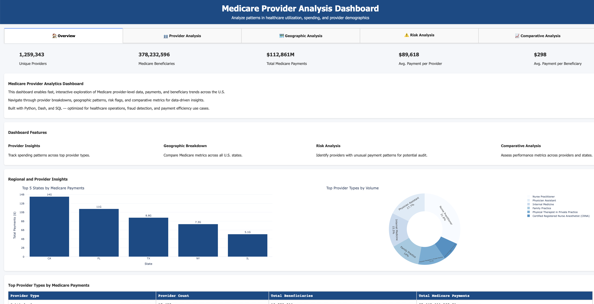

# 🏥 Medicare Fraud Detection & Provider Payment Analysis (2023)

An interactive data analytics dashboard designed to analyze Medicare provider-level data, detect potential fraud, and optimize healthcare spending. Built with **Python**, **Dash**, and **SQL**, this project enables deep dives into provider behaviors, geographic trends, and high-risk flagging.

---

## 📋 Table of Contents
1. [Project Overview](#-project-overview)
2. [Tech Stack](#-tech-stack)
3. [Data Source](#-data-source)
4. [Features](#-features-in-detail)
5. [How to Run the Project](#️-how-to-run-the-project)
6. [Screenshots](#-screenshots)

---

## 🚀 Project Overview

### **Objective**
- Detect anomalous payment behavior among Medicare providers.
- Provide insights into healthcare utilization, spending, and provider demographics.
- Enable data-driven decision-making for fraud detection and payment optimization.

### **Key Features**
- **Provider Analysis**: Explore spending patterns across provider types.
- **Geographic Analysis**: Visualize Medicare metrics across U.S. states.
- **Risk Analysis**: Identify high-risk providers with unusual payment patterns.
- **Comparative Analysis**: Compare performance metrics across providers and states.
- **Interactive Dashboard**: Navigate insights with dynamic visualizations and data tables.

---

## 🛠️ Tech Stack

- **Programming Language**: Python
- **Frameworks**: Dash, Plotly
- **Database**: SQLite
- **Data Processing**: Pandas, NumPy
- **Visualization**: Plotly Express, Dash Components

---

## 📊 Data Source

The dataset used in this project is the **2023 Medicare Physician & Other Practitioners Dataset**, provided by the Centers for Medicare & Medicaid Services (CMS). You can access the dataset [here](https://data.cms.gov/provider-summary-by-type-of-service/medicare-physician-other-practitioners/medicare-physician-other-practitioners-by-provider/data).

- **Dataset Size**: 1M+ Medicare claims records
- **Key Metrics**:
  - Total Medicare Payments
  - Payment Per Beneficiary
  - Payment Per Service
  - Provider Count
  - Geographic Distribution

---

## 🌟 Features in Detail

### **1. Provider Analysis**
- Visualize provider distribution by type, total payments, and average payment metrics.
- Identify top-performing and underperforming provider types.
- Generate actionable insights with efficiency and anomaly detection.

### **2. Geographic Analysis**
- Explore Medicare spending and service distribution across U.S. states.
- Compare metrics like payment per beneficiary and provider count.
- Visualize data using choropleth maps and bar charts.

### **3. Risk Analysis**
- Detect high-risk providers with anomalous payment-to-service ratios.
- Highlight providers with unusually high payments for potential audits.
- Generate insights into risk patterns and financial impact.

### **4. Comparative Analysis**
- Compare performance metrics across provider types or states.
- Identify correlations between key metrics (e.g., payments and services).
- Highlight outliers and efficiency patterns for benchmarking.

---

## 🖥️ How to Run the Project

### **1. Clone the Repository**
```bash
git clone https://github.com/jshchng/medicare-fraud-analysis.git
cd medicare-fraud-analysis
```

### **2. Create Virtual Environment and Install Dependencies**
```bash
python3 -m venv venv
source venv/bin/activate
pip install -r requirements.txt
```

### **3. Load the Data**
```bash
python scripts/load_data.py
```

### **4. Launch the Dashboard**
```bash
python dashboard.py
```
Open your browser and navigate to http://localhost:8050.

---

## 📸 Screenshots
### **1. Dashboard Overview**
The main dashboard provides an overview of Medicare provider data, including key metrics and visualizations.


### **2. Provider Analysis**
Analyze provider distribution by type, total payments, and average payment metrics.


### **3. Geographic Analysis**
Visualize Medicare spending and service distribution across U.S. states using interactive maps and charts.


### **4. Risk Analysis**
Identify high-risk providers with anomalous payment-to-service ratios and generate actionable insights.


### **5. Comparative Analysis**
Compare performance metrics across provider types or states to identify trends and outliers.
